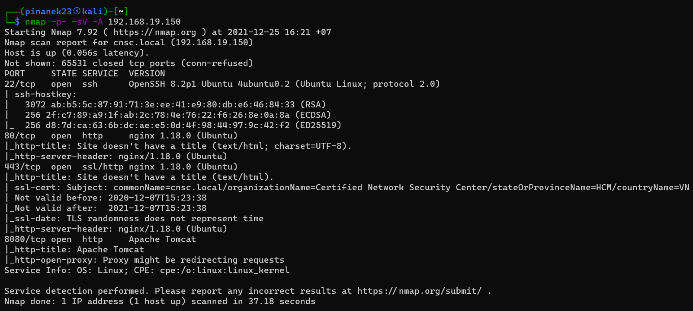
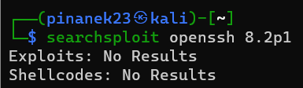
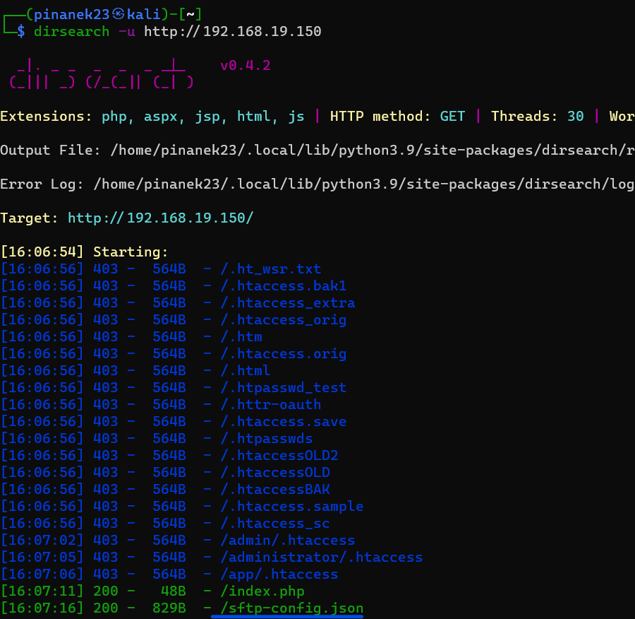
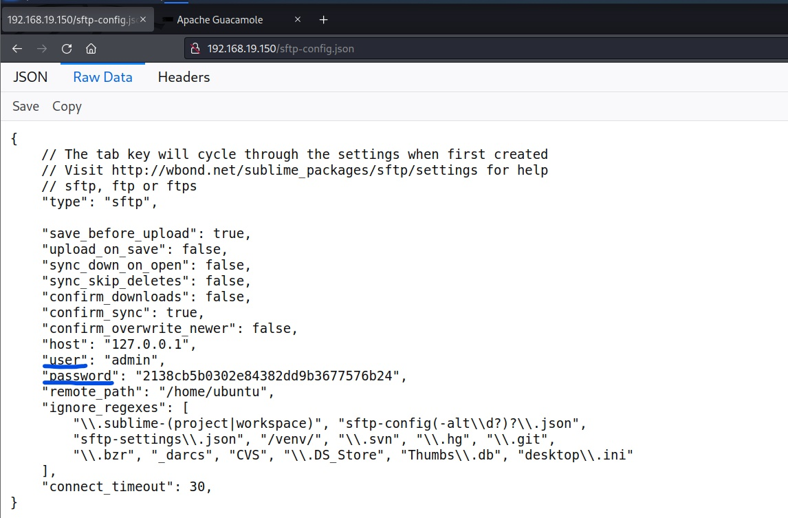
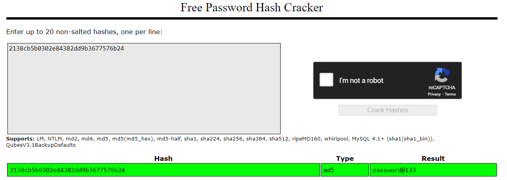
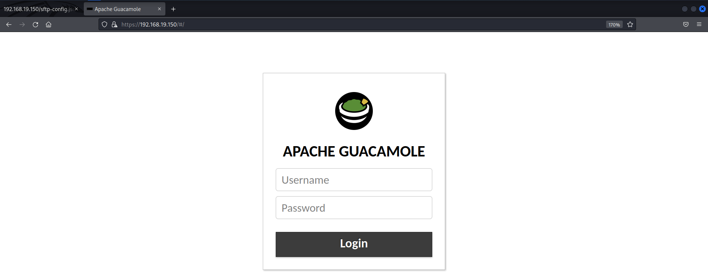
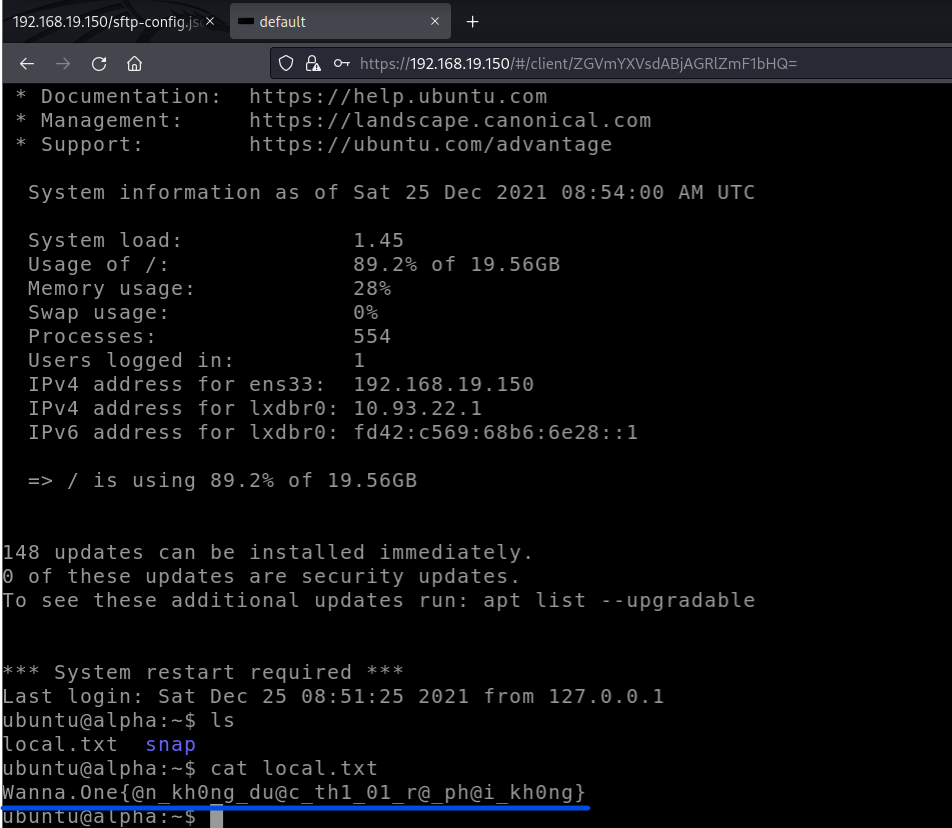
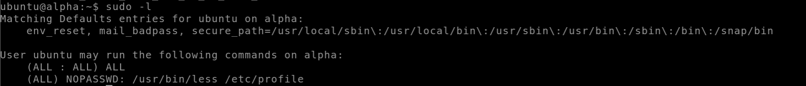
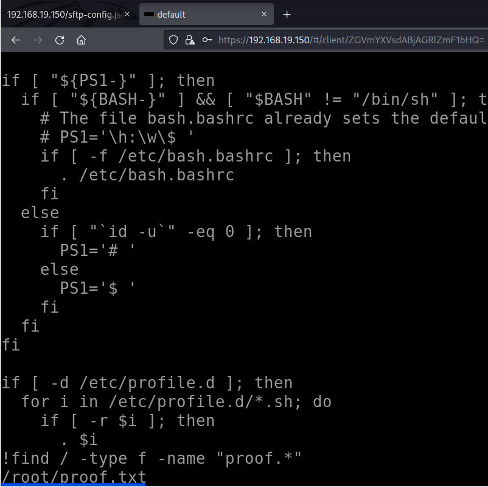

# Alpha Machine (Linux)

## Local

- Scan machine với nmap, có được các port 22, 80, 443, 8080

  

- Kiểm tra OpenSSH với `searchsploit`, không có phát hiện gì

  

- Vậy thì đầu tiên, sẽ kiểm tra port 80 với `dirsearch`, phát hiện ra 1 file config `sftp-config.json`

  

- Truy cập vào file `sftp-config.json`, có được username và password nhưng chưa rõ là ở đâu

  ```
  username: admin
  password: password@123
  ```

  

  

- Sau khi truy cập http trên web browser thì không có gì, truy cập vào https, ta có thể thử username và password

  

- Đăng nhập thành công, có được local flag

  

> Flag: Wanna.One{@n_kh0ng_du@c_th1_01_r@_ph@i_kh0ng}

## Proof

- Kiểm tra xem các users, commands có quyền sử dụng `sudo`, thấy rằng `/usr/bin/less` và `/etc/profile` không cần password để có thể sử dụng `sudo`

  

- Vậy sẽ mở file `/etc/profile` để có quyền thực thi câu lệnh dưới quyền root với câu lệnh

  ```console
  sudo /usr/bin/less nano /etc/profile
  ```

- Sau đó trong `nano`, thực hiện câu lệnh find để tìm file `proof.*` với câu lệnh

  ```
  find / -type f name "proof.*"
  ```

  

- Có được proof flag

  

> Flag: Wanna.One{nqu0j_cu4_c0nq_ckunq_pk4j_dj_v40_10nq_nqu0j,_cku_dunq_dj_v40_10nq_d4t}