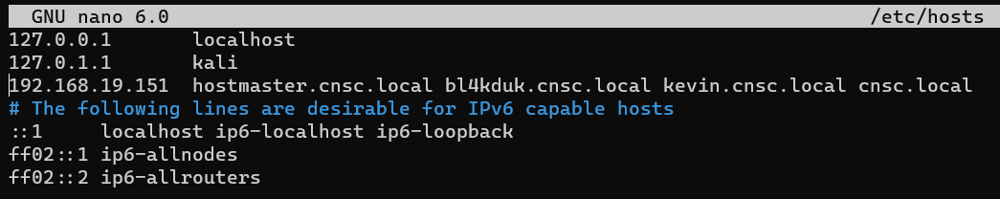
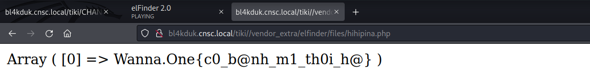

# Kevin Machine (Windows)

## Local

- Scan machine với nmap, có được các port, theo hint của đề thì sẽ kiểm tra port 53, ngoài ra còn port 80, ta sẽ kiểm tra sau

  

- Thêm domain `cnsc.local` vào file `/etc/hosts`, Kiểm tra zone transfer với `dig`, có được các subdomain `kevin.cnsc.local` và `bl4kduk.cnsc.local`, sau đó thêm các subdomain này vào `/etc/hosts`

  

  

- `dirsearch` với subdomain `kevin.cnsc.local`, không có gì đặc biệt

  

- `dirsearch` với subdomain `bl4kduk.cnsc.local`, phát hiện 1 file config `/assets/sftp-config.json`, ngoài ra còn 2 folder `assets` và `tiki`, sẽ kiểm tra sau

  

- Truy cập vào file `sftp-config.json`, có được username và password nhưng chưa rõ là ở đâu

  ```
  username: steve
  password: M@t1<h4uCuaSt3vEdaynha@192!
  ```

  

- Truy cập vào folder `assets` không thành công, truy cập vào folder `tiki` thì thấy có sử dụng login, thử đăng nhập bằng tài khoản được tìm thấy và thành công

  

  

- Quét folder `tiki` với tài khoản chứng thực trên, thấy có file `CHANGELOG.TXT`, ta có thể tìm thấy version của `tiki` ở đây, và version là `15.1`

  

  

- Kiểm tra với `searchsploit`, thấy rằng ta có thể upload file lên tiki

  

- Tìm và thấy được cách để exploit machine local: https://github.com/ivanitlearning/Tiki-Wiki-15.1-unrestricted-file-upload/blob/master/tikiwiki_15.1_RCE.py

  - Đầu tiên ta sẽ truy cập vào file 

  

  

- Kiểm tra rằng là có thực thi các câu lệnh được không, và có thể thực hiện được, code: https://www.php.net/manual/en/function.exec.php#refsect1-function.exec-examples

  

  


- Vậy ta sẽ tìm file local.txt, như hình trên thì đang ở ổ `C:`, ta sẽ trở về root tại `C:` và tìm với câu lệnh:

  ```console
  cd \ && dir /s local.txt
  ```

  

  

- Sau đó có được flag tại `C:\Users\steve\Desktop\local.txt` bằng câu lệnh:

  ```console
  type C:\Users\steve\Desktop\local.txt
  ```

  

  

> Flag: Wanna.One{c0_b@nh_m1_th0i_h@}